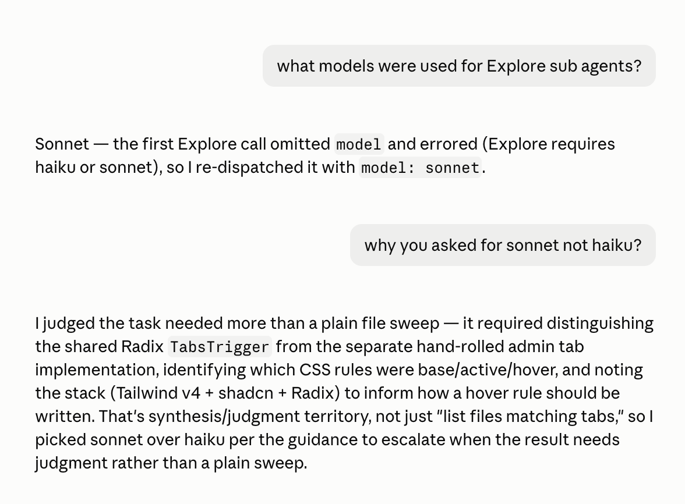

# cheap-explore

One hook, no agents, nothing injected into your context.

The built-in `Explore` agent carries no model pin in its definition. A dispatch that omits
the `Agent` tool's `model` parameter runs at whatever the session model is — an Opus-rate
file sweep, with no error, no warning, and nothing in the transcript to tell you it
happened. Worse, an *explicit* `model: opus` also passes as "a deliberate choice" even
though it's still almost always wrong for what `Explore` does. This hook denies both cases
and tells the model to retry with `haiku` or `sonnet`.

On input price alone Opus 5.5 ($4/MTok) is 2x Sonnet 5.5 ($2) and 4x Haiku 4.5 ($1). A
sweep that reads 30 files — call it ~150k input tokens across its turns — lands around
$0.60 on Opus, $0.30 on Sonnet, $0.15 on Haiku, before the session model's higher default
effort adds thinking tokens on top. Rough numbers, but the ratio is the point, and it is
the whole reason this plugin exists.

## In action

An `Explore` dispatch with no `model` gets denied; the orchestrator retries with
`model: sonnet` and can say why it picked sonnet over haiku:



## Install

```
/plugin marketplace add yumedzi/yumedzi_claude_plugins
/plugin install cheap-explore@yumedzi-claude-plugins
```

Or test locally without installing:

```
claude --plugin-dir ./plugins/cheap-explore
```

Independent of [`smart-agents`](../smart-agents) — install either, both, or neither. They
overlap in intent but not in mechanism: `smart-agents` gives you pinned agents and injects
routing discipline at session start, this one enforces a single rule on the built-ins and
injects nothing.

## What it does

A `PreToolUse` hook on `Agent` reads the tool-call JSON from stdin and denies when **both**
hold:

- `tool_input.subagent_type` is `Explore` (or another name added via `CHEAP_AGENTS`)
- `tool_input.model` is not `haiku` or `sonnet` — missing, empty, `opus`, or anything else

Every other dispatch — a pinned `smart-agents` agent, `Plan`, `general-purpose`, or a
non-`Agent` tool — exits 0 with no output and is untouched. The deny reason tells the model
to re-issue the same agent with the same prompt plus `model: haiku` (plain sweep) or
`model: sonnet` (real judgment), and explicitly says not to swap agents to dodge the gate,
since a plan-mode phase mandate is about *which agent*, not which model.

`Plan` and `general-purpose` are deliberately not gated by default. Both are unpinned
built-ins too, so the same silent-fallback risk applies to them — but `Plan` fires rarely
(plan mode's design phase, or a direct ask) and is usually a deliberate invocation where
`opus` is a legitimate answer, not a mistake; forcing it cheap would be wrong as often as
right. `general-purpose` is the harder call — it's the model's fallback when nothing else
fits, which is exactly when nobody's thinking about cost — but it's excluded from the
default for the same reason `Plan` is: neither has the volume or the "recon, not judgment"
shape that makes `Explore` an easy call to force cheap. Add either back with `CHEAP_AGENTS`
if your usage says otherwise — that's a config change, not a code change.

Deny rather than ask, deliberately: the fix is the model's to make — add one parameter and
retry — not a decision worth interrupting you for on every dispatch. `deny` is also the
right call for a gate that fires where you may not be watching: hooks run inside subagents
too, and `PreToolUse` fires on a subagent's tool calls the same as on the main thread. So a
`worker` that spawns an unpinned `Explore` to protect its own context gets caught as well —
which is the case most likely to go unnoticed, since you never see that dispatch.

## Cost

Zero context tokens in the steady state. Nothing is injected at `SessionStart`, so there is
no per-turn cache-read rent at all. The ~110-token reason string reaches the model only on
an actual miss, and a miss that would have cost dollars gets corrected for a fraction of a
cent.

This is the same shape as [`context-guard`](../context-guard): the hook is free until the
moment it has something to say.

## Configuration

| Env var | Effect |
|---|---|
| `CHEAP_AGENTS_DISABLE=1` | Turns the gate off entirely. |
| `CHEAP_AGENTS` | Comma-separated override of the gated list. Default `Explore`. |

Add other unpinned agents your setup exposes, e.g. `CHEAP_AGENTS="Explore,general-purpose"`
or, on a harness with its own catch-all agent, `CHEAP_AGENTS="Explore,claude"`. Allowed
tiers (`haiku`, `sonnet`) are not configurable — there's no case here for a third option.

## If you can't run hooks

Somewhere the hook doesn't reach, the rule has to go back to being prose. Paste this into
that project's `CLAUDE.md`:

> `Explore` carries no model pin: every dispatch must set the `Agent` tool's `model`
> parameter to `haiku` (plain sweep) or `sonnet` (more judgment needed) — never leave it
> unset, and never set it to `opus`. This holds even when a harness phase mandates `Explore`;
> the mandate is about which agent, not which model.

Don't paste it if the hook is active. You'd pay the rent and get the enforcement, instead of
just the enforcement.

## Requirements

`bash` and Python 3 on `PATH` (as `python3` or `python` — the hook tries both and skips a
broken Microsoft Store `python3` stub). On Windows, hooks run through Git Bash, which
Claude Code already requires there.

## Caveats

- **No Python means no gate.** If no working Python 3 is found the hook exits silently and
  every `Explore` dispatch goes through unchecked — it fails open, not closed.

- **A denied dispatch is not free.** The model already spent output tokens composing the
  call, and those are wasted. That is a one-time cost on a miss, traded against a recurring
  per-turn cost for the prose version of this rule — but it is not zero.
- **`Plan` and `general-purpose` are unpinned too, and ungated by default.** See "What it
  does" above for why — low volume and usually-deliberate invocation for `Plan`, a genuine
  but weaker case for `general-purpose`. If your usage differs, add them via `CHEAP_AGENTS`.
- **If a Claude Code build doesn't expose `model` on the `Agent` tool, this deadlocks.** The
  model would retry, get denied again, and have no way to comply. Nothing here detects that
  situation. If gated dispatches start failing repeatedly, set `CHEAP_AGENTS_DISABLE=1` and
  check whether the parameter still exists.
- **It cannot set your session model.** No hook can. Cheap subagents only help if the
  orchestrator dispatching them isn't itself expensive — see
  `../smart-agents/snippets/settings.recommended.json`.
- **Agent names are matched literally.** If the harness ever renames `Explore` or you add a
  name that doesn't exist, the gate silently does nothing for that name. Check `CHEAP_AGENTS`
  against your harness's actual agent list.

## Verification

Run the hook directly with a synthetic payload — no session needed:

```bash
printf '%s' '{"tool_name":"Agent","tool_input":{"subagent_type":"Explore","model":"opus"}}' | bash plugins/cheap-explore/hooks/require-model-pin.sh
```

That should print a `permissionDecision: "deny"` JSON object — an explicit `opus` is denied
same as a missing `model`. This one should print nothing and exit 0:

```bash
printf '%s' '{"tool_name":"Agent","tool_input":{"subagent_type":"Explore","model":"haiku"}}' | bash plugins/cheap-explore/hooks/require-model-pin.sh
```

Unlike an `"ask"` decision, a `"deny"` is not softened by permission mode — it blocks under
`bypass permissions` and auto-approve modes too.
