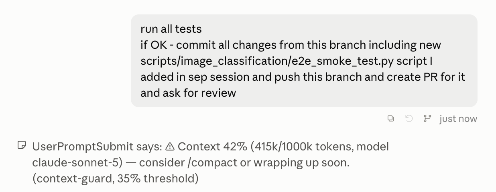

# context-guard

A single `UserPromptSubmit` hook that warns you when a session's context usage crosses
35%, and again at 50% — nothing else. It never talks to the model: the warning is a
`systemMessage`, which Claude Code shows in the terminal UI only. It is not sent to Claude
and never appears in the session transcript, so it cannot inflate the context it's warning
you about.

## In action

The warning shows up under your prompt as UI-only text. It is not part of the transcript:



## Install

```
/plugin marketplace add yumedzi/yumedzi_claude_plugins
/plugin install context-guard@yumedzi-claude-plugins
```

Or test locally without installing:

```
claude --plugin-dir ./plugins/context-guard
```

## What the hook does

On every prompt, `hooks/warn-context-usage.sh` reads the tail (last 512KB — transcripts can
reach tens of MB, so it never parses the whole file) of the session transcript named in the
hook payload, and finds the most recent main-thread assistant turn's `usage` block
(`isSidechain` entries — subagent turns — are skipped, since they'd under-report the main
thread). Usage is `input_tokens + cache_creation_input_tokens + cache_read_input_tokens`.

The context window limit isn't given anywhere in the hook payload, so it's inferred from
the active model name reported in the transcript's `usage` block. Per
[docs.claude.com/en/docs/build-with-claude/context-windows](https://docs.claude.com/en/docs/build-with-claude/context-windows),
Opus 4.6+ (including 5 and 5.5), Sonnet 4.6+ (including 5 and 5.5), and Fable/Mythos default
to a 1M-token window; Haiku (all
versions) and Sonnet 4.5 stay at 200,000. The hook matches on substrings of the model id
(`"haiku"`, `"sonnet-4-5"`) rather than an exact list, so it keeps working across future
point releases without a code change — but it falls back to the smaller 200,000 window if
the model field is ever missing.

Each threshold fires **once per session**: state is a one-byte file per session ID under
`${TMPDIR:-/tmp}/claude-context-guard/`, tracking the highest tier already warned. A prompt
that jumps straight from 20% to 55% usage in one turn only shows the 50% warning, not both.

## Configuration

All via environment variables (e.g. in `settings.json`'s `env` block):

| Variable | Default | Effect |
|---|---|---|
| `CONTEXT_GUARD_WARN1` | `35` | First threshold, percent. |
| `CONTEXT_GUARD_WARN2` | `50` | Second threshold, percent. |
| `CONTEXT_GUARD_LIMIT` | *(inferred)* | Force the context window size in tokens; skips model-based inference entirely. |
| `CONTEXT_GUARD_DISABLE` | *(unset)* | Set to `1` to make the hook a no-op. |

## Cost

Genuinely zero model tokens: `systemMessage` is UI-only and is never part of the prompt or
transcript Claude reads. The wall-clock cost is one Python invocation per prompt
(reading ≤512KB off disk), typically well under 50ms, plus a trivial probe to find a
working interpreter.

## Requirements

`bash` and Python 3 on `PATH` (as `python3` or `python` — the hook tries both and skips a
broken Microsoft Store `python3` stub). On Windows, hooks run through Git Bash, which
Claude Code already requires there. With no working Python the hook does nothing — no
warning, no error.

## Caveats

- **Warn-only, by design — not a fixable limitation.** Hooks run with no controlling
  terminal (no `/dev/tty`, no user stdin) since Claude Code v2.1.139, so an interactive
  "continue / stop / compact" picker isn't buildable from a hook at all. Hooks also cannot
  trigger compaction — only `/compact` or auto-compact do. So this hook only surfaces the
  number; acting on it (running `/compact`, wrapping up, starting a fresh session) is
  manual. See [code.claude.com/docs/en/hooks](https://code.claude.com/docs/en/hooks).
- **The limit is inferred, not reported.** No hook payload field advertises the context
  window size directly — it's derived from a substring match on the model name, which
  breaks if a future model changes its default window without a name change (e.g. a
  200k-by-default model gaining an opt-in 1M beta). Set `CONTEXT_GUARD_LIMIT` up front if
  you know the inference will be wrong for your session.
- **Usage lags by one turn.** The number reflects the last completed assistant turn's
  `usage` block, not a live count of the prompt currently being submitted.
