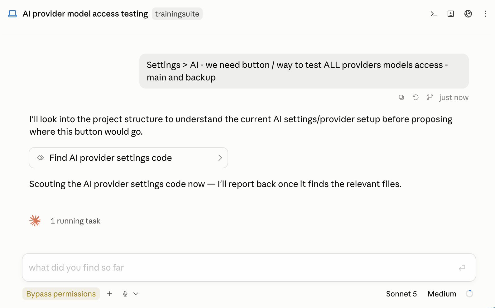

# smart-agents

Four delegation agents, each pinned to the cheapest model tier that can do the job, plus a
SessionStart hook that reminds the orchestrator to actually route work to them instead of
doing everything itself.

| Agent | Tier | Current model | Effort | $/MTok in | $/MTok out | Dispatch when |
|---|---|---|---|---|---|---|
| `scout` | `haiku` | Haiku 4.5 | – | $1 | $5 | An area is named but not the exact files, or orienting would take 5+ greps/reads. Read-only. |
| `researcher` | `sonnet` | Sonnet 5.5 | `medium` | $2 | $10 | An open-ended external question needs several sources triangulated. |
| `worker` | `sonnet` | Sonnet 5.5 | `high` | $2 | $10 | A self-contained code change with full context given up front. |
| `deep-thinker` | `opus` | Opus 5.5 | `xhigh` | $4 | $20 | Architecture tradeoffs, root-cause analysis, or a worker that failed twice and reported up. Orchestrator-only, read-only. |

Agents are pinned by **tier alias** (`haiku` / `sonnet` / `opus`), not an exact model ID, so
the plugin keeps routing to "the current Haiku-tier model" rather than needing a version
bump every time a new model ships in that tier. Prices above are as of Opus 5.5 / Sonnet 5.5
(2026-10); the routing itself never needed updating for that release.

Effort is pinned in each agent's frontmatter (`effort:`), which is the only lever — the
`Agent` tool has no per-dispatch effort override, and an agent with no `effort:` inherits
the session's level (Claude Code defaults to `xhigh`). Why these values:

- **`researcher` at `medium`.** Anthropic's published effort curves for research and
  knowledge work are nearly flat — `medium` matched `high` on accuracy for noticeably less
  spend. Without the pin it would run at whatever the session runs at, often `xhigh`.
- **`worker` stays at `high`.** For coding the curve is a real tradeoff: each step down
  costs a few points of pass rate for a substantially lower cost per task. Here a worker
  failure isn't retried at a higher effort — after two it escalates to `deep-thinker` on
  Opus at `xhigh`, so a failure is the expensive path. The "run low, re-run failures
  higher" pattern only pays when the retry is the same cheap model. If your worker tasks
  are mostly mechanical edits, `medium` is a reasonable local override.
- **`deep-thinker` at `xhigh`.** Opus 5.5 defaults to `medium` (one level below Opus 5);
  the explicit pin keeps the escalation target thinking hard.
- **`scout` unpinned.** Haiku 4.5 doesn't take an effort setting.

## In action

On a session running Sonnet, the orchestrator hands off "find the AI provider settings
code" to `scout` instead of reading files on its own:



## Install

```
/plugin marketplace add yumedzi/yumedzi_claude_plugins
/plugin install smart-agents@yumedzi-claude-plugins
```

Or test locally without installing:

```
claude --plugin-dir ./plugins/smart-agents
```

## What the hook does

A `SessionStart` hook injects a short delegation policy — route by task shape, do trivial
lookups yourself, escalate cheap-first on repeated failure, keep subagent reports terse —
so the orchestrator doesn't have to be reminded in every prompt. It fires on every
`SessionStart` event (startup, resume, `/clear`, compaction), not just the first prompt of a
session, so the policy doesn't silently disappear partway through a long session.

The policy also covers the built-in `Explore` and `Plan` agents, which this plugin cannot
replace: simple recon goes to `scout` instead, and whenever a harness phase mandates `Explore`
or `Plan` (plan mode does, for its exploration and design phases respectively), the policy says
to comply with that restriction rather than substituting `scout`.

Measured cost of that injection: 1,591 bytes (~397 tokens), written to the prompt cache
once per SessionStart event and read back on every subsequent turn. On Opus 5.5 pricing
($4 base, 1-hour cache write at 2x, cache read $0.20/MTok) that's roughly $0.003 to write
and under $0.0001 per turn to read — about 1 cent for a 100-turn session. The rent is not the reason to think twice about this hook; if you'd rather not pay
even that, drop `hooks/` and keep only `agents/` — the four agents still work standalone,
you'll just need to ask for them by name.

## Pairs with cheap-explore

Until v1.2.0 the policy also carried a paragraph demanding that every `Explore` / `Plan`
dispatch pass the `Agent` tool's `model` parameter, since those built-ins have no model pin
and otherwise fall back to the session model. That paragraph is gone. It was ~118 tokens of
rent on every turn of every session, and it was only ever a request — nothing checked that
the orchestrator complied, and it didn't stop an *explicit* `model: opus` either.

[`cheap-explore`](../cheap-explore) now enforces the equivalent rule for `Explore` as a
`PreToolUse` deny: costs nothing until a dispatch actually needs correcting, can't be
ignored, and also blocks `opus` outright rather than treating it as a deliberate choice.
It deliberately does not cover `Plan` — that one's usually a deliberate invocation where
`opus` is a legitimate answer, not a mistake, so forcing it cheap would be wrong as often
as right; see cheap-explore's README for the reasoning. Install it alongside this plugin if
you want the `Explore` guarantee. Neither plugin depends on the other.

## deep-thinker confirmation gate

A `PreToolUse` hook fires on every `Agent` dispatch and reads the tool-call JSON from stdin;
`hooks/gate-deep-thinker.sh` checks `tool_input.subagent_type` and only returns
`permissionDecision: "ask"` when it's `smart-agents:deep-thinker` — every other dispatch
(scout, researcher, worker) exits 0 with no output and is unaffected. The filtering happens
in the script rather than in `hooks.json` because there's no documented `if`-rule syntax for
matching a `tool_input` field (the documented forms are tool-name/argument patterns like
`Bash(git *)`, not `key=value` field matches).

This asks for confirmation on every dispatch, not just once per session — by design, since
each dispatch is a separate cost decision. If that gets in the way for your workflow, remove
the `PreToolUse` block from `hooks/hooks.json` (the `SessionStart` policy hook is independent
and unaffected).

Whether `"ask"` surfaces as a real interactive approval prompt depends on your terminal's
permission mode — under `bypass permissions` or an auto-approve mode it may resolve without
stopping. Test it in your own interactive session with:

    claude --plugin-dir ./plugins/smart-agents

then ask it to use the deep-thinker agent, and confirm you see a prompt naming the cost
before it dispatches.

## Optional: project CLAUDE.md snippet

`snippets/CLAUDE.md` is **not** loaded automatically by anything — it's a template you can
paste into a project's real `CLAUDE.md` (or `.claude/CLAUDE.md`) if you want the routing
discipline to apply somewhere the SessionStart hook doesn't reach — a headless run, or a
project where the hook is disabled. Once pasted, it *is* loaded every session for that
project, the same as any other project instructions, so only copy it if you actually want
that. `snippets/settings.recommended.json` pairs with it — it sets the orchestrator's own
model floor (`"model": "sonnet"`), since delegation only saves money if the orchestrator
itself is cheap to run and no hook or CLAUDE.md snippet can set that for you.

## Requirements

`bash` and Python 3 on `PATH` (as `python3` or `python`) for the `deep-thinker` gate; the
SessionStart policy hook is pure bash on purpose so it loads even without Python. On
Windows, hooks run through Git Bash, which Claude Code already requires there. If no
working Python 3 is found (e.g. only the Microsoft Store `python3` stub), the gate **fails
open** — `deep-thinker` dispatches without the confirmation prompt, silently.

## Three honest caveats

- **The `Agent` tool listed in each agent's frontmatter is not a spawn sandbox.** It reflects
  intent — "this agent is meant to delegate to these others" — but nothing in the harness
  enforces that list once an agent is running, so an agent can dispatch outside it. The one
  part of the cost hierarchy that *is* backed by tooling is `deep-thinker`: hooks also run
  inside subagents, and `PreToolUse` fires on a subagent's tool calls exactly as it does on
  the main thread (the payload gains `agent_id` / `agent_type` identifying the caller), so
  the confirmation gate below catches a nested dispatch from a `worker`, not just one you
  issue yourself. What that gate does *not* pin down is how a `permissionDecision: "ask"`
  resolves when you aren't attending the subagent's execution — untested here. The rest of
  the hierarchy is instruction only.
- **This plugin cannot set your main model.** No hook can. Delegation only saves money if
  the orchestrator itself runs on a reasonably cheap model — see
  `snippets/settings.recommended.json` for a starting point (`"model": "sonnet"`).
- **Nothing here stops an unpinned `Explore` dispatch from running at session-model rates,
  or `Plan` / `general-purpose` from doing the same.** The policy tells the orchestrator to
  prefer `scout` for recon, but if it dispatches a built-in anyway without a `model`
  parameter, that sweep runs at full price with no error or warning. Install
  [`cheap-explore`](../cheap-explore) if you want `Explore` blocked rather than merely
  discouraged — it doesn't cover `Plan` or `general-purpose` by default, though its
  `CHEAP_AGENTS` list can be extended to either.

## Attribution

The agent prompts in this plugin are adapted from
[`marsmike/claude-subagents`](https://github.com/marsmike/claude-subagents). That
repository does not declare a license. This project's own `LICENSE` (MIT) covers only
the original content here — the hook script, manifests, and docs — not the adapted
agent prompts; see `LICENSE` for the full note.
